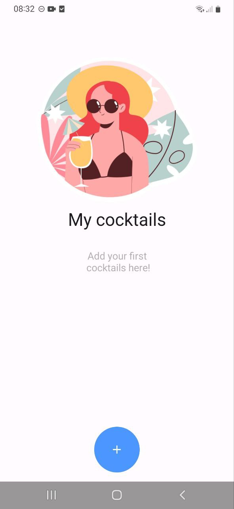
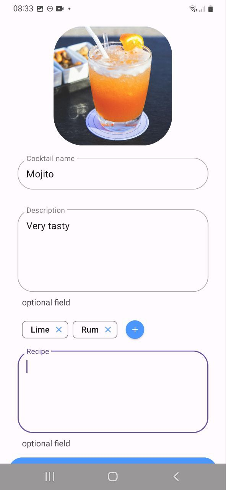
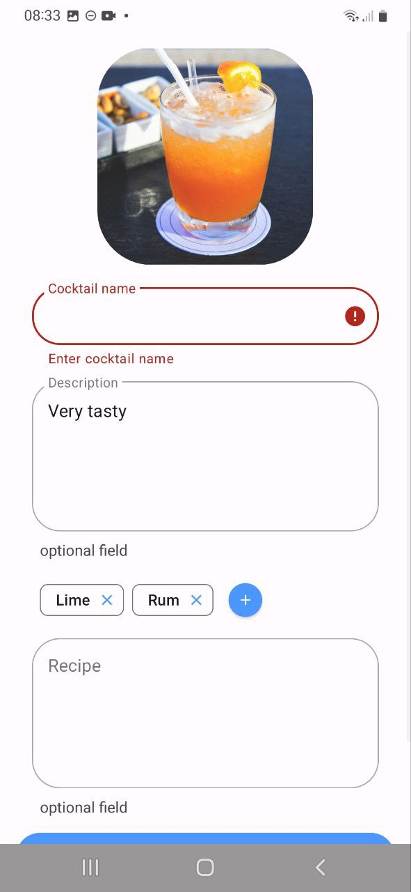
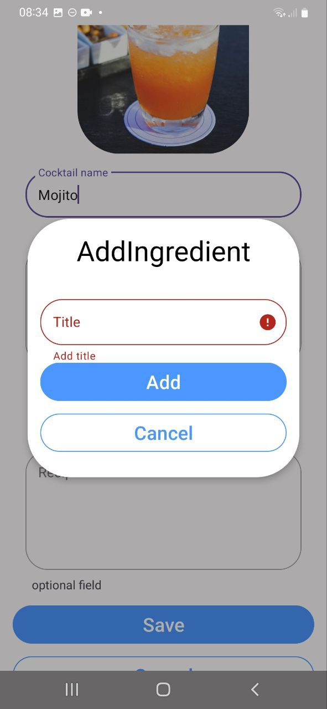
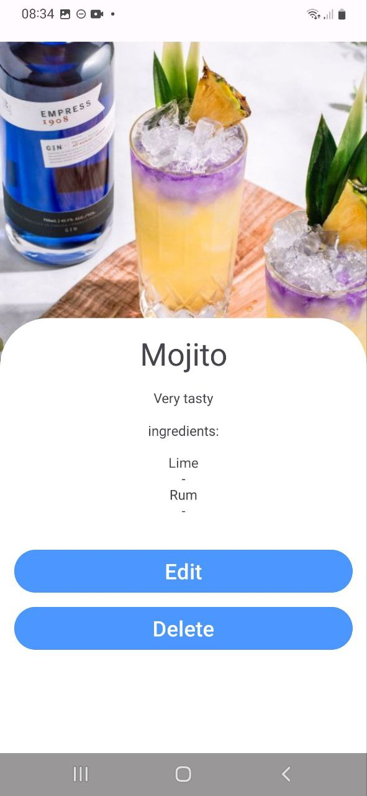

# CocktailBar
Приложение для хранения информации о коктейлях
Было разработано в ходе летней школы Surf

[установочный файл](https://github.com/StasShevchenko/CocktailBar/tree/master/assets/app-debug.apk)

## Что было реализовано
Приложение позволяет добавлять новые коктейли, редактировать и удалять уже существующие, а также просматривать список ваших коктейлей. 
При добавлении можно указать название коктейля, добавить описание, добавить ингредиенты и рецепт.

### Не было реализовано
Не были выполнены дополнительные задания 1, 2 и 5, также нет корректной обработки состояния загрузки данных из БД, из-за чего можно увидеть прыгающий UI, например, когда переходишь на деталку (на гифке это хорошо видно)

## Демонстрация работы

Полный флоу работы приложения:  
</img>

Скриншоты приложения:   

  
  
  
  
  

## Архитектура и технологии
Приложение разбито на data и presentation слой. 
В presentation слое был использован паттерн MVVM (view model реализация от google). 

Для навигации в проекте используется NavigationComponent 
Для хранения данных используется Room 

